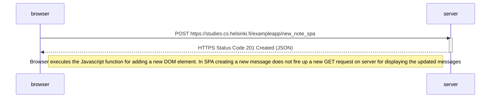

User makes a new post in Single Page Application https://studies.cs.helsinki.fi/exampleapp/spa

```mermaid
sequenceDiagram
    participant browser
    participant server
    
    browser->>server: POST https://studies.cs.helsinki.fi/exampleapp/new_note_spa
    activate server
    server-->>browser: HTTPS Status Code 201 Created (JSON)
    deactivate server

    Note right of browser: Browser executes the Javascript function for adding a new DOM element. In SPA creating a new message does not fire up a new GET request on server for displaying the updated messages
```